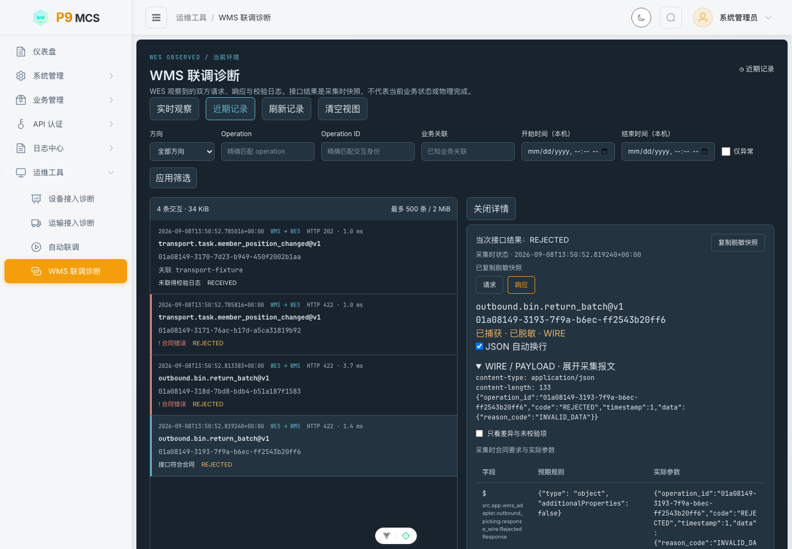
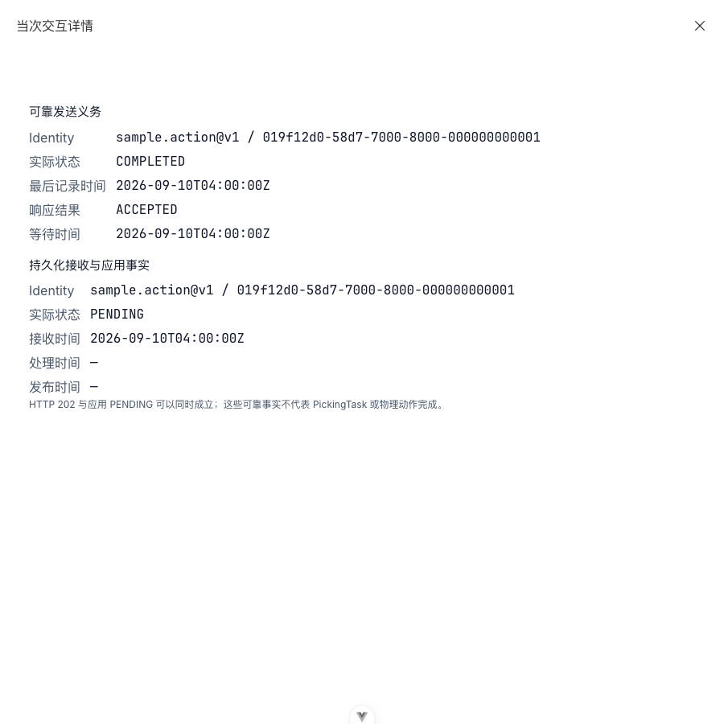
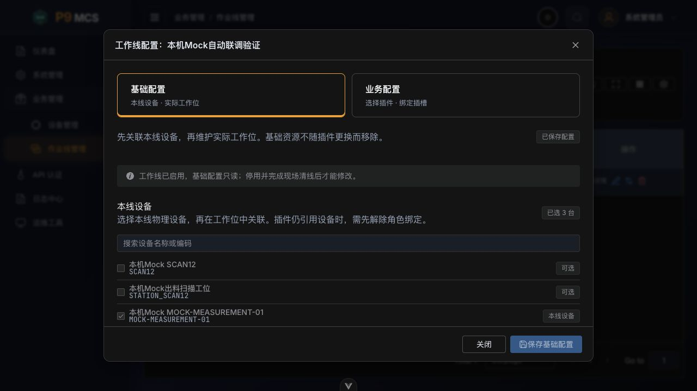
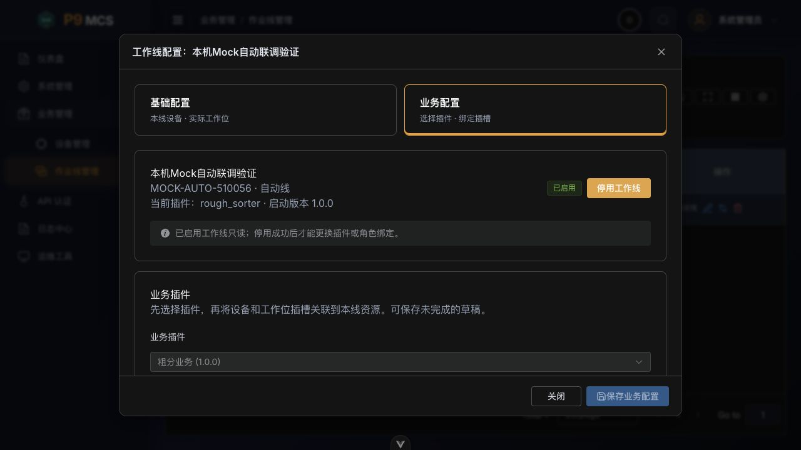

# P9 MCS 前端项目

> **项目名称**: P9 MCS 前端项目 (休斯顿智能物料控制系统前端)
> **仓库地址**: https://github.com/kaizhoumasha/wes_frontend
> **后端项目**: https://github.com/kaizhoumasha/wes_backend

## 技术栈

- **框架**: Vue 3.5+ (Composition API + `<script setup>`)
- **语言**: TypeScript 5.9+
- **构建工具**: Vite 7.3+
- **状态管理**: Pinia 3.0+
- **路由**: Vue Router 5.0+
- **UI 组件**: Element Plus 2.13+、Tailwind CSS 4.2+
- **HTTP 客户端**: alova 3.5+
- **包管理器**: pnpm 10+

## 快速开始

### 环境要求

- Node.js 20.19+ / 22.12+ (推荐 22 LTS)
- pnpm 10+

### 安装依赖

```bash
pnpm install
```

### 开发模式

仅调试前端页面且不依赖真实后端行为时：

```bash
pnpm dev
```

访问: http://localhost:5173

需要前后端、PostgreSQL/Redis、Celery、WMS/ECS Mock 共同运行时，显式指定两个 checkout，再使用后端唯一联调入口。这样从主仓库或任意标准 worktree 执行都不会依赖目录相邻关系：

```bash
export WES_BACKEND_ROOT=/absolute/path/to/wes_backend
export WES_FRONTEND_ROOT="$(git rev-parse --show-toplevel)"
cd "$WES_BACKEND_ROOT"
./scripts/dev-env.sh up
./scripts/dev-env.sh check
./scripts/dev-env.sh logs frontend api
```

联调容器绑定当前前端源码并启用 Vite HMR；使用 `./scripts/dev-env.sh down` 停止后会保留持久化数据和前端依赖缓存。完整规范位于后端仓库 `docs/devops/local-development-environment.md`。

### 构建生产版本

```bash
pnpm build
```

### 代码检查

```bash
pnpm lint
pnpm type:check
```

### 契约与代码生成

```bash
pnpm contract:freeze -- --backend-root /path/to/wes_backend
pnpm generate:types
pnpm generate:zod
pnpm generate:permissions
pnpm permission:verify
pnpm contract:verify
pnpm contract:test
pnpm export:release-consumer
```

`contract:freeze` 是唯一需要后端 checkout 的显式冻结步骤，会原子更新 OpenAPI 与权限 canonical 快照。后续生成、验证和 consumer artifact 导出均只读取前端仓库已提交快照，可离线执行。

## WMS 联调诊断

在「运维工具 → WMS 联调诊断」打开控制台（`/ops/wms-diagnostics`）。页面展示 WES 观察到的 WMS 双向 Operation 请求、响应和校验日志；查询、实时订阅与详情读取分别受权限控制。

- 在「实时观察」查看 SSE 推送，在「近期记录」按方向、Operation、Operation ID、业务关联或时间范围查询；「仅异常」用于缩小排查范围。
- 点击记录，切换请求或响应，展开 WIRE / PAYLOAD，比较采集时的合同规则与实际参数，并复制脱敏快照。合法业务拒绝与合同校验错误分别显示，未知或缺失 Operation 的接入异常也会保留。
- 不依赖近期记录也可输入 `operation` 与 `operation_id`，点击「查询可靠事实」，分别读取可靠发送义务和持久化接收与应用事实。两类查询分别需要 `ops:wms-confirmation:read`、`ops:wms-evidence:read`；仅有其中一个权限也能进入页面，近期记录、实时订阅与交互详情仍受各自权限控制。
- 可靠事实显示原始身份、实际状态与记录时间；未找到记录不等于从未收发，存储暂不可用时显示「当前无法确认」。HTTP 202 与应用 PENDING 可以同时成立，发送义务完成也不代表物理动作完成。
- 「暂停滚动」仍接收更新；「清空视图」清除当前页面记录、详情与可靠事实，并使未完成查询的迟到响应失效，不删除后端记录。关闭详情也会停止当前身份的后续刷新。页面最多保留 500 条 / 2 MiB，断线期间不会补推，出现间隙提示后可手动查询近期记录；重连会刷新仍在查看的可靠事实。
- 在「运维工具 → 运输接入诊断」（`/ops/transport-diagnostics`）查看冻结等待期限、发送次数、发布进度、待应用证据与资源占用；持有 `ops:transport-callback-receipt:read` 时可按回调身份查询收据。收据查询独立于所选任务，接收、发布和物理完成应分别判断。

这些记录是采集时的接口快照，不是远端 WMS 内部日志，也不代表当前业务状态或物理完成。下图使用正式 Operation 的演示数据展示合同错误与合法拒绝，不代表现场验收。



窄屏可靠事实查询示例使用本机隔离演示数据，不代表现场验收：



## 设备接入诊断

在「运维工具 → 设备接入诊断」（`/ops/device-diagnostics`）查看近期设备回调、Evidence 状态与 WES 本地观察，并按设备、消息类型、命令或应用状态过滤。

- `DEVICE_OBSERVATION` 是 WES 对命令未接纳或结果未知的本地事实，不是供应商 callback；列表展示观察结论、原因和观察时间。
- `APPLIED` 只表示 Evidence 已应用，不代表设备动作物理完成；结果未知也不表示设备当前故障或物理失败。
- 页面合并历史快照与实时 SSE 更新；出现消息缺口或历史加载失败时，可刷新历史或重连恢复当前视图。

## 工作线配置

在「业务管理 → 作业线管理」（`/biz/worklines`）点击「配置」，进入独立配置页面（`/biz/worklines/:id/configuration`），按「关联设备 → 选择插件 → 配置插槽」完成配置。

1. 在「关联设备」添加本线物理设备，支持服务端分页、名称或编码搜索及归属筛选；跨页勾选会保留，添加后保存本线设备。
2. 在「选择插件」确认业务插件和资源要求，再进入「配置插槽」，按「设备插槽 → 本线设备」「工作位插槽 → 本线工作位」绑定。缺少设备时点击「前往关联设备」；缺少工作位时直接在插槽步骤新建或编辑，填写工作位编码、名称与执行位置编码（WMS / RCS），按需设置容量、货架属性和关联设备。插槽仅绑定本线已保存的资源。切换插件清空旧插槽绑定，保留基础资源。
3. 草稿允许暂缺绑定，页面显示绑定进度；可保存当前步骤，前两步也可「保存并继续」。保存不会启动工作线，也不代表业务已就绪。启动前须满足全部必需插槽和启用检查。离开页面或切换基础资源与业务配置时会提示处理未保存修改，保存后自动读取最新版本；设备选择弹窗打开时须先完成或取消选择，才能切换步骤或离开页面。
4. 已启用工作线的配置只读，停用并完成现场清线后才能修改；版本冲突时重新打开，读取最新配置。

工作位插槽绑定本线工作位编码，由后端在运行时解析为实际执行位置；设备插槽绑定独立设备编码，设备可以共用 ECS 地址。页面不预设分拣线工作位模板或扫码设备数量。

以下截图来自本机 Mock 环境数据，保留旧版双分区布局供参考；当前独立页面采用上述三步骤，不代表现场验收。





## Git Worktree 开发

### 创建新的 worktree

```bash
./scripts/git-worktree.sh add feature-your-feature
```

### 列出所有 worktree

```bash
./scripts/git-worktree.sh list
```

### 删除 worktree

```bash
./scripts/git-worktree.sh remove feature-your-feature
```

## 项目结构

```
src/
├── api/           # API 请求层（base / modules / services / streaming / generated）
├── assets/        # 静态资源
├── components/    # 通用组件、UI 组件、Smart Search 组件
├── composables/   # 组合式函数（CRUD / 布局 / 搜索等复用逻辑）
├── config/        # 环境变量与 API 配置
├── layouts/       # 布局组件
├── router/        # 路由配置
├── stores/        # Pinia 状态管理
├── types/         # TypeScript 类型
├── utils/         # 工具函数
└── views/         # 页面视图
```

## 环境变量

- `.env.development`: 开发环境配置
- `.env.production`: 生产环境配置

## 相关文档

- [设计系统](./DESIGN.md)
- [更新日志](./CHANGELOG.md)
- [TODO 清单](./TODOS.md)
- [技术选型文档](./docs/WES_FRONTEND_TECH_STACK.md)
- [CRUD 开发指南](./docs/CRUD_DEVELOPMENT_GUIDE.md)
- [ECS 设备发现与显式接管设计](./docs/designs/ecs-device-discovery-onboarding.md)
- [设备联调 Epoch 历史与 WES 整链清理设计](./docs/designs/device-diagnostics-debug-epoch-history-cleanup.md)：历史设计，因 LineRunEpoch 退役已失效，不再作为实施依据
- [智能搜索组件架构](./docs/SMART_SEARCH_COMPONENT_ARCHITECTURE.md)
- [时区处理指南](./docs/TIMEZONE_HANDLING.md)
- [契约同步工作流](./docs/CONTRACT_SYNC_WORKFLOW.md)
- [契约测试指南](./docs/CONTRACT_TESTING.md)

## CI/CD

- GitHub Actions: `.github/workflows/ci-cd.yml`
- Jenkins 独立 producer: `Jenkinsfile` 只构建并发布不可变前端镜像，不接收后端候选，也不自动部署
- Docker: `Dockerfile`, `docker-compose.yml`

producer 成功只表示 `PUBLISHED — NOT DEPLOYED`。TEST/生产部署由独立发布作业按镜像 digest 选择候选，并在维护态前执行方向性兼容检查。

## 开发命令

| 命令                 | 说明           |
| -------------------- | -------------- |
| `pnpm dev`           | 启动开发服务器 |
| `pnpm build`         | 构建生产版本   |
| `pnpm preview`       | 预览构建结果   |
| `pnpm lint`          | 代码检查       |
| `pnpm type:check`    | 类型检查       |
| `pnpm test`          | 单元测试       |
| `pnpm contract:test` | 契约测试       |

## 后端 API

- **本地开发**: http://localhost:8001
- **Swagger 文档**: http://localhost:8001/api/docs
- **OpenAPI 文档**: http://localhost:8001/api/openapi.json

## License

MIT
