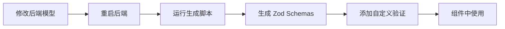

# 前端表单验证方案

## 设计理念

**单一数据源 + 前端扩展**

1. **基础验证规则**：从后端 Pydantic 模型自动提取（通过 OpenAPI）
2. **前端自定义验证**：在扩展文件中添加业务特定的验证规则
3. **类型安全**：完整的 TypeScript 类型推断

---

## 快速开始

### 1. 生成 Zod Schemas

从后端 OpenAPI 自动生成验证规则：

```bash
# 确保后端正在运行
cd ../wes_backend && python -m uvicorn src.main:app --reload

# 在前端项目生成 schemas
pnpm exec tsx scripts/generate-zod-from-openapi.ts
```

生成文件：

- `src/types/generated/zod-schemas.ts` - 自动生成（**请勿手动编辑**）
- `src/types/zod-extensions.ts` - 自定义扩展（**在此添加自定义验证**）

---

### 2. 在组件中使用

#### 基础用法

```vue
<script setup lang="ts">
import { useForm } from 'vee-validate'
import { toTypedSchema } from '@vee-validate/zod'
import { UserCreateSchema } from '@/types/zod-extensions'

const { handleSubmit, errors, defineField } = useForm({
  validationSchema: toTypedSchema(UserCreateSchema)
})

const [username, usernameAttrs] = defineField('username')
const [email, emailAttrs] = defineField('email')
const [password, passwordAttrs] = defineField('password')

const onSubmit = handleSubmit(async values => {
  await createUser(values)
})
</script>

<template>
  <form @submit="onSubmit">
    <div>
      <label>用户名</label>
      <input v-model="username" v-bind="usernameAttrs" />
      <span v-if="errors.username">{{ errors.username }}</span>
    </div>

    <div>
      <label>邮箱</label>
      <input v-model="email" v-bind="emailAttrs" />
      <span v-if="errors.email">{{ errors.email }}</span>
    </div>

    <div>
      <label>密码</label>
      <input v-model="password" type="password" v-bind="passwordAttrs" />
      <span v-if="errors.password">{{ errors.password }}</span>
    </div>

    <button type="submit">提交</button>
  </form>
</template>
```

#### 与 Element Plus 集成

```vue
<script setup lang="ts">
import { useForm } from 'vee-validate'
import { toTypedSchema } from '@vee-validate/zod'
import { UserCreateSchema } from '@/types/zod-extensions'

const { handleSubmit, errors } = useForm({
  validationSchema: toTypedSchema(UserCreateSchema)
})

const onSubmit = handleSubmit(async values => {
  await createUser(values)
  ElMessage.success('创建成功')
})
</script>

<template>
  <el-form @submit.prevent="onSubmit">
    <el-form-item label="用户名" :error="errors.username">
      <el-input v-model="values.username" />
    </el-form-item>

    <el-form-item label="邮箱" :error="errors.email">
      <el-input v-model="values.email" type="email" />
    </el-form-item>

    <el-form-item label="密码" :error="errors.password">
      <el-input v-model="values.password" type="password" />
    </el-form-item>

    <el-form-item>
      <el-button type="primary" native-type="submit">提交</el-button>
    </el-form-item>
  </el-form>
</template>
```

---

## 自定义验证规则

### 添加前端特定验证

在 `src/types/zod-extensions.ts` 中扩展：

```typescript
import { z } from 'zod'
import { UserCreateSchema } from './generated/zod-schemas'

// 添加自定义验证
export const UserCreateSchemaExtended = UserCreateSchema.superRefine((data, ctx) => {
  // 用户名不能包含特殊字符
  if (!/^[a-zA-Z0-9_]+$/.test(data.username)) {
    ctx.addIssue({
      code: z.ZodIssueCode.custom,
      message: '用户名只能包含字母、数字和下划线',
      path: ['username']
    })
  }

  // 邮箱必须是公司域名
  if (data.email && !data.email.endsWith('@example.com')) {
    ctx.addIssue({
      code: z.ZodIssueCode.custom,
      message: '请使用公司邮箱',
      path: ['email']
    })
  }

  // 密码强度要求
  if (data.password) {
    if (!/[A-Z]/.test(data.password)) {
      ctx.addIssue({
        code: z.ZodIssueCode.custom,
        message: '密码必须包含至少一个大写字母',
        path: ['password']
      })
    }
    if (!/[a-z]/.test(data.password)) {
      ctx.addIssue({
        code: z.ZodIssueCode.custom,
        message: '密码必须包含至少一个小写字母',
        path: ['password']
      })
    }
    if (!/[0-9]/.test(data.password)) {
      ctx.addIssue({
        code: z.ZodIssueCode.custom,
        message: '密码必须包含至少一个数字',
        path: ['password']
      })
    }
  }
})
```

### 使用扩展 Schema

```typescript
import { UserCreateSchemaExtended } from '@/types/zod-extensions'

const { handleSubmit } = useForm({
  validationSchema: toTypedSchema(UserCreateSchemaExtended)
})
```

---

## 工作流

### 开发流程



### 后端验证规则变更时的处理

1. **后端修改 Pydantic 模型**（如修改 `min_length`）
2. **重启后端**（更新 OpenAPI）
3. **运行生成脚本**：`pnpm exec tsx scripts/generate-zod-from-openapi.ts`
4. **前端自动同步** - 无需手动修改验证规则

---

## 常见问题

### Q: 为什么某些字段的验证规则没有被生成？

**A:** 检查后端 OpenAPI 是否包含该字段的验证规则：

```bash
curl -s http://localhost:8001/api/openapi.json | jq '.components.schemas.YourSchema'
```

如果 OpenAPI 中没有该规则，说明后端 Pydantic 模型配置有问题。常见原因：

- 使用了继承模型，但 Field 约束未正确传递
- 使用了 `ModelFactory` 等自定义工厂，未正确处理约束

**解决方案**：修复后端模型，确保验证规则暴露到 OpenAPI。

### Q: 如何添加跨字段验证？

**A:** 使用 `.superRefine()` 添加复杂的跨字段验证：

```typescript
export const RegisterSchemaExtended = UserCreateSchema.superRefine((data, ctx) => {
  // 确认密码匹配
  if (data.password !== data.confirmPassword) {
    ctx.addIssue({
      code: z.ZodIssueCode.custom,
      message: '两次输入的密码不一致',
      path: ['confirmPassword']
    })
  }
})
```

### Q: 如何覆盖生成的验证规则？

**A:** 在扩展文件中使用 `.merge()` 或 `.superRefine()`：

```typescript
export const UserCreateSchemaCustom = UserCreateSchema.merge(
  z.object({
    username: z.string().min(5).max(20) // 覆盖原有规则
  })
)
```

---

## 生成的 Schema 示例

### LoginRequestSchema

```typescript
export const LoginRequestSchema = z.object({
  username: z.string().min(3).max(50),
  password: z.string().min(6).max(100)
})
```

### UserCreateSchema

```typescript
export const UserCreateSchema = z.object({
  username: z.string(),
  email: z.string(),
  full_name: z.union([z.string(), z.null()]).optional(),
  password: z.string().min(6).max(100)
})
```

---

## 相关文档

- [Vee-Validate 文档](https://vee-validate.logaretm.com/)
- [Zod 文档](https://zod.dev/)
- [后端 Pydantic 模型](../../wes_backend/src/app/admin/models/user.py)
- [契约测试文档](./CONTRACT_TESTING.md)
