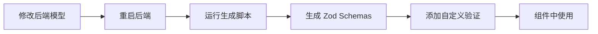

# 前端表单验证方案

> **📌 同步流程**: 当后端模型变化时，请参考 [**前后端契约同步工作流**](./CONTRACT_SYNC_WORKFLOW.md) 进行同步。

## 🎯 设计理念

**契约驱动 + 单一数据源**

```
后端 Pydantic Model → OpenAPI → Zod Schema → 前端表单验证
        ↓                    ↓            ↓           ↓
    唯一权威源          自动同步      类型安全     用户反馈
```

### 核心价值

1. **契约一致性**：前端验证规则直接从后端模型生成，确保约束完全同步
2. **零维护成本**：后端修改验证规则后，重新生成 schemas 即可自动同步
3. **类型安全**：完整的 TypeScript 类型推断，无需手动维护类型定义

---

## 📋 快速开始

### 1. 生成 Zod Schemas

从后端 OpenAPI 自动生成验证规则：

```bash
# 确保后端正在运行
cd ../wes_backend && python -m uvicorn src.main:app --reload

# 在前端项目生成 schemas
pnpm exec tsx scripts/generate-zod-from-openapi.ts
```

生成文件：

- `src/types/generated/zod-schemas.ts` - 自动生成（**请勿手动编辑**）
- `src/types/zod-extensions.ts` - 自定义扩展（**在此添加自定义验证**）

---

### 2. 在组件中使用（vee-validate 4.15+）

#### ✅ 正确用法（v4.15+）

> **重要**：vee-validate 4.6+ 版本支持直接传递 Zod schema，**无需** `toTypedSchema`

```vue
<script setup lang="ts">
import { useForm } from 'vee-validate'
import { UserCreateSchema } from '@/types/zod-extensions'
import { userApi, type CreateUserInput } from '@/api/modules/user'

// 关键：使用泛型参数实现类型推断
const { handleSubmit, errors, defineField } = useForm<CreateUserInput>({
  validationSchema: UserCreateSchema // ✅ 直接传递 Zod schema
})

// 定义表单字段
const [username, usernameAttrs] = defineField('username')
const [email, emailAttrs] = defineField('email')
const [password, passwordAttrs] = defineField('password')

// 提交处理 - values 类型自动推断为 CreateUserInput
const onSubmit = handleSubmit(async values => {
  await userApi.create(values) // ✅ 无需类型断言
})
</script>

<template>
  <form @submit="onSubmit">
    <div>
      <label>用户名</label>
      <input
        v-model="username"
        v-bind="usernameAttrs"
      />
      <span v-if="errors.username">{{ errors.username }}</span>
    </div>

    <div>
      <label>邮箱</label>
      <input
        v-model="email"
        v-bind="emailAttrs"
      />
      <span v-if="errors.email">{{ errors.email }}</span>
    </div>

    <div>
      <label>密码</label>
      <input
        v-model="password"
        type="password"
        v-bind="passwordAttrs"
      />
      <span v-if="errors.password">{{ errors.password }}</span>
    </div>

    <button type="submit">提交</button>
  </form>
</template>
```

#### 与 Element Plus 集成

```vue
<script setup lang="ts">
import { useForm } from 'vee-validate'
import { UserCreateSchema } from '@/types/zod-extensions'
import type { CreateUserInput } from '@/api/modules/user'

const { handleSubmit, errors, defineField } = useForm<CreateUserInput>({
  validationSchema: UserCreateSchema
})

const [username] = defineField('username')
const [email] = defineField('email')
const [password] = defineField('password')

const onSubmit = handleSubmit(async values => {
  await createUser(values)
  ElMessage.success('创建成功')
})
</script>

<template>
  <el-form @submit.prevent="onSubmit">
    <el-form-item
      label="用户名"
      required
      :error="errors.username"
    >
      <el-input
        v-model="username"
        autocomplete="username"
      />
    </el-form-item>

    <el-form-item
      label="邮箱"
      required
      :error="errors.email"
    >
      <el-input
        v-model="email"
        type="email"
        autocomplete="email"
      />
    </el-form-item>

    <el-form-item
      label="密码"
      required
      :error="errors.password"
    >
      <el-input
        v-model="password"
        type="password"
        show-password
        autocomplete="new-password"
      />
    </el-form-item>

    <el-form-item>
      <el-button
        type="primary"
        native-type="submit"
      >
        提交
      </el-button>
    </el-form-item>
  </el-form>
</template>
```

#### ❌ 错误用法（v4.6+）

```typescript
// ❌ 不要使用 toTypedSchema（v4.6+ 不需要）
validationSchema: toTypedSchema(UserCreateSchema)

// ❌ 不要使用类型断言绕过类型检查
await userApi.create(values as CreateUserInput)
```

---

### 3. 动态 Schema（创建/编辑模式）

```vue
<script setup lang="ts">
import { computed } from 'vue'
import { useForm } from 'vee-validate'
import { UserCreateSchema, UserUpdateSchema } from '@/types/zod-extensions'
import type { CreateUserInput, UpdateUserInput } from '@/api/modules/user'

interface Props {
  userId: number | null // null = 创建模式
}

const props = defineProps<Props>()

const isEditMode = computed(() => props.userId !== null)

// 包含所有可能字段的表单值类型
interface FormValues {
  username: string
  email: string
  full_name?: string
  password?: string
}

// 使用 computed 动态切换 schema
const { handleSubmit, errors, defineField, resetForm } = useForm<FormValues>({
  validationSchema: computed(() => (isEditMode.value ? UserUpdateSchema : UserCreateSchema))
})

// ... defineField 定义 ...

// 提交时根据模式构造正确的数据
const onSubmit = handleSubmit(async values => {
  if (isEditMode.value) {
    const updateData: UpdateUserInput = {
      email: values.email,
      full_name: values.full_name
    }
    emit('submit', updateData)
  } else {
    const createData: CreateUserInput = {
      username: values.username,
      email: values.email,
      full_name: values.full_name,
      password: values.password!
    }
    emit('submit', createData)
  }
})
</script>
```

---

## 🔧 自定义验证规则

### 添加前端特定验证

> **重要**：所有前端特定的自定义验证应在 `zod-extensions.ts` 中添加

```typescript
// src/types/zod-extensions.ts
import { z } from 'zod'
import { UserCreateSchema } from './generated/zod-schemas'

// 添加自定义验证
export const UserCreateSchemaExtended = UserCreateSchema.superRefine((data, ctx) => {
  // 用户名不能包含特殊字符
  if (!/^[a-zA-Z0-9_]+$/.test(data.username)) {
    ctx.addIssue({
      code: z.ZodIssueCode.custom,
      message: '用户名只能包含字母、数字和下划线',
      path: ['username']
    })
  }

  // 邮箱必须是公司域名
  if (data.email && !data.email.endsWith('@example.com')) {
    ctx.addIssue({
      code: z.ZodIssueCode.custom,
      message: '请使用公司邮箱',
      path: ['email']
    })
  }

  // 密码强度要求
  if (data.password) {
    if (!/[A-Z]/.test(data.password)) {
      ctx.addIssue({
        code: z.ZodIssueCode.custom,
        message: '密码必须包含至少一个大写字母',
        path: ['password']
      })
    }
    if (!/[a-z]/.test(data.password)) {
      ctx.addIssue({
        code: z.ZodIssueCode.custom,
        message: '密码必须包含至少一个小写字母',
        path: ['password']
      })
    }
    if (!/[0-9]/.test(data.password)) {
      ctx.addIssue({
        code: z.ZodIssueCode.custom,
        message: '密码必须包含至少一个数字',
        path: ['password']
      })
    }
  }
})
```

### 使用扩展 Schema

```typescript
import { UserCreateSchemaExtended } from '@/types/zod-extensions'

const { handleSubmit } = useForm<CreateUserInput>({
  validationSchema: UserCreateSchemaExtended // ✅ 直接传递扩展后的 schema
})
```

---

## 🔄 工作流

### 开发流程



### 后端验证规则变更时的处理

1. **后端修改 Pydantic 模型**（如修改 `min_length`）
2. **重启后端**（更新 OpenAPI）
3. **运行生成脚本**：`pnpm exec tsx scripts/generate-zod-from-openapi.ts`
4. **前端自动同步** - 无需手动修改验证规则 ✅

### 关键原则

| 原则           | 说明                            | 示例                                                 |
| -------------- | ------------------------------- | ---------------------------------------------------- |
| **单一数据源** | 后端 Pydantic 模型是唯一权威源  | 用户名长度约束只在一处定义                           |
| **自动生成**   | 前端验证规则从 OpenAPI 自动生成 | `pnpm exec tsx scripts/generate-zod-from-openapi.ts` |
| **前端扩展**   | 业务特定验证在扩展文件中添加    | 用户名不能包含特殊字符                               |
| **类型安全**   | 完整的 TypeScript 类型推断      | `values` 自动推断为 `CreateUserInput`                |
| **零维护**     | 后端修改后重新生成即可自动同步  | 无需手动维护验证规则                                 |

---

## 📚 常见问题

### 添加前端特定验证

在 `src/types/zod-extensions.ts` 中扩展：

```typescript
import { z } from 'zod'
import { UserCreateSchema } from './generated/zod-schemas'

// 添加自定义验证
export const UserCreateSchemaExtended = UserCreateSchema.superRefine((data, ctx) => {
  // 用户名不能包含特殊字符
  if (!/^[a-zA-Z0-9_]+$/.test(data.username)) {
    ctx.addIssue({
      code: z.ZodIssueCode.custom,
      message: '用户名只能包含字母、数字和下划线',
      path: ['username']
    })
  }

  // 邮箱必须是公司域名
  if (data.email && !data.email.endsWith('@example.com')) {
    ctx.addIssue({
      code: z.ZodIssueCode.custom,
      message: '请使用公司邮箱',
      path: ['email']
    })
  }

  // 密码强度要求
  if (data.password) {
    if (!/[A-Z]/.test(data.password)) {
      ctx.addIssue({
        code: z.ZodIssueCode.custom,
        message: '密码必须包含至少一个大写字母',
        path: ['password']
      })
    }
    if (!/[a-z]/.test(data.password)) {
      ctx.addIssue({
        code: z.ZodIssueCode.custom,
        message: '密码必须包含至少一个小写字母',
        path: ['password']
      })
    }
    if (!/[0-9]/.test(data.password)) {
      ctx.addIssue({
        code: z.ZodIssueCode.custom,
        message: '密码必须包含至少一个数字',
        path: ['password']
      })
    }
  }
})
```

### 使用扩展 Schema

```typescript
import { UserCreateSchemaExtended } from '@/types/zod-extensions'

const { handleSubmit } = useForm({
  validationSchema: toTypedSchema(UserCreateSchemaExtended)
})
```

---

## 📚 常见问题

### Q: 为什么某些字段的验证规则没有被生成？

**A:** 检查后端 OpenAPI 是否包含该字段的验证规则：

```bash
curl -s http://localhost:8001/api/openapi.json | jq '.components.schemas.YourSchema'
```

如果 OpenAPI 中没有该规则，说明后端 Pydantic 模型配置有问题。常见原因：

- 使用了继承模型，但 Field 约束未正确传递
- 使用了 `ModelFactory` 等自定义工厂，未正确处理约束

**解决方案**：修复后端模型，确保验证规则暴露到 OpenAPI。

### Q: 如何添加跨字段验证？

**A:** 使用 `.superRefine()` 添加复杂的跨字段验证：

```typescript
export const RegisterSchemaExtended = UserCreateSchema.superRefine((data, ctx) => {
  // 确认密码匹配
  if (data.password !== data.confirmPassword) {
    ctx.addIssue({
      code: z.ZodIssueCode.custom,
      message: '两次输入的密码不一致',
      path: ['confirmPassword']
    })
  }
})
```

### Q: vee-validate 版本差异？

**A:** 不同版本的 API 有显著差异：

| 版本      | 用法                                          | 说明                   |
| --------- | --------------------------------------------- | ---------------------- |
| **v4.6+** | `useForm<Type>({ validationSchema: schema })` | 直接传递 Zod schema    |
| **v5**    | `useForm({ validationSchema: schema })`       | 自动推断类型，无需泛型 |

当前项目使用 **v4.15**，应使用泛型参数的写法。

### Q: 如何覆盖生成的验证规则？

**A:** 在扩展文件中使用 `.merge()` 或 `.superRefine()`：

```typescript
export const UserCreateSchemaCustom = UserCreateSchema.merge(
  z.object({
    username: z.string().min(5).max(20) // 覆盖原有规则
  })
)
```

---

## 📖 生成的 Schema 示例

### UserCreateSchema（自动生成）

```typescript
export const UserCreateSchema = z.object({
  username: z.string().min(3).max(50), // ← 从后端 Pydantic 模型生成
  email: z.string().max(100), // ← 从后端 Pydantic 模型生成
  full_name: z.union([z.string(), z.null()]).optional(),
  password: z.string().min(6).max(100) // ← 从后端 Pydantic 模型生成
})
```

### UserUpdateSchema（自动生成）

```typescript
export const UserUpdateSchema = z.object({
  username: z.union([z.string(), z.null()]).optional(),
  email: z.union([z.string(), z.null()]).optional(),
  full_name: z.union([z.string(), z.null()]).optional()
})
```

---

## 🔗 相关文档

- [Vee-Validate 文档](https://vee-validate.logaretm.com/)
- [Zod 文档](https://zod.dev/)
- [后端 Pydantic 模型](../../wes_backend/src/app/admin/models/user.py)
- [契约测试文档](./CONTRACT_TESTING.md)

---

## 📝 版本说明

- **vee-validate**: 4.15.1
- **zod**: 3.25.76
- **@vee-validate/zod**: 4.15.1

本文档基于上述版本编写，不同版本可能存在 API 差异。
